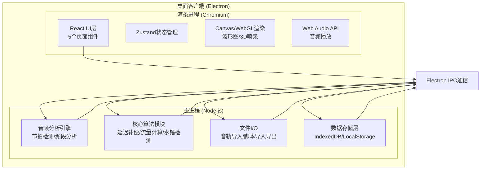
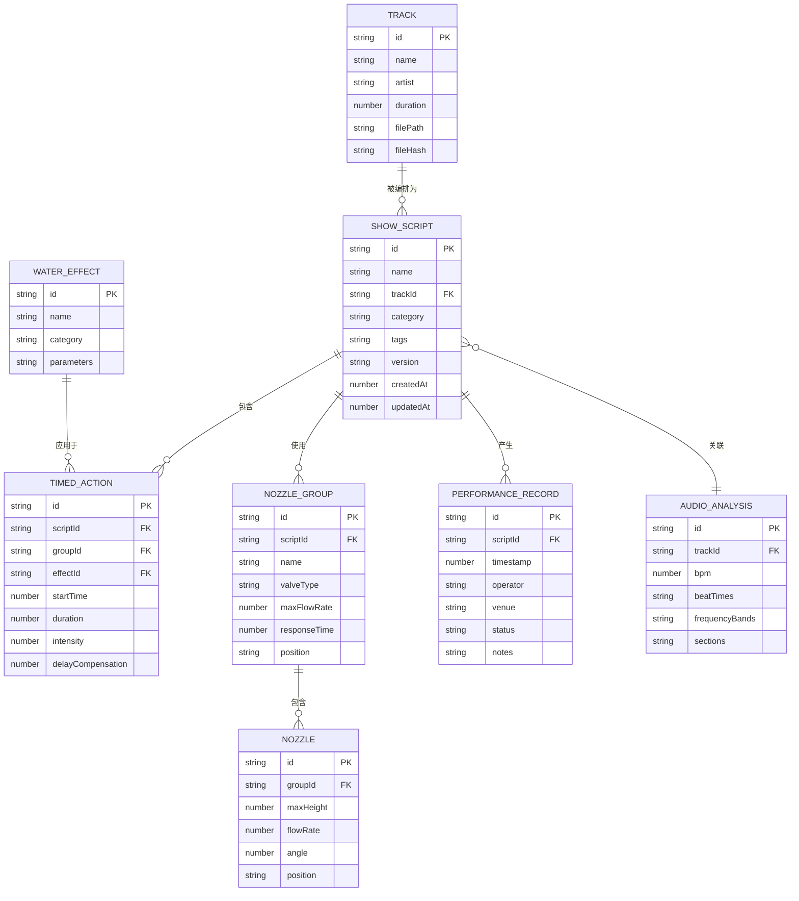

## 1. 架构设计

本系统采用 Electron + React 混合架构，桌面端运行，前端负责UI与交互，Node.js后端处理音频分析与算法计算，本地存储管理数据。



## 2. 技术描述

### 2.1 技术栈选型

| 层级 | 技术选型 | 版本 | 用途 |
|------|----------|------|------|
| 桌面框架 | Electron | 28.x | 桌面客户端容器，跨平台支持 |
| 前端框架 | React | 18.x | UI组件化开发 |
| 语言 | TypeScript | 5.x | 类型安全，提升可维护性 |
| 构建工具 | Vite | 5.x | 快速开发构建 |
| 样式 | TailwindCSS | 3.x | 原子化CSS，快速开发 |
| 状态管理 | Zustand | 4.x | 轻量级状态管理 |
| 路由 | React Router | 6.x | 单页路由 |
| 音频处理 | Meyda | 5.x | 音频特征提取、节拍检测 |
| 3D渲染 | Three.js | 0.160.x | 3D喷泉场景渲染 |
| 3D React封装 | @react-three/fiber | 8.x | React风格的Three.js封装 |
| 3D工具库 | @react-three/drei | 9.x | 常用3D组件 |
| 图表 | Canvas API 原生 | - | 波形图、频谱图、时间轴绘制 |
| 数据库 | IndexedDB (Dexie.js) | 4.x | 本地脚本库数据存储 |
| 图标 | Lucide React | 0.300.x | 图标库 |

### 2.2 核心依赖说明

- **Meyda.js**：音频特征提取库，支持RMS能量、频谱、节拍检测等，用于音轨解析
- **Three.js + react-three-fiber**：3D渲染，实现喷泉效果可视化模拟
- **Dexie.js**：IndexedDB封装，管理脚本库本地存储
- **Zustand**：轻量级状态管理，避免Redux的复杂性

### 2.3 初始化工具

使用 Vite + React + TypeScript 模板初始化，配合 Electron 打包配置。

## 3. 路由定义

| 路由路径 | 页面名称 | 用途 |
|----------|----------|------|
| / | 音轨解析页 | 音乐导入、节拍检测、频段分析 |
| /choreography | 水形编排页 | 喷头组管理、水形绑定、段落编排 |
| /calibration | 时序校准页 | 延迟补偿、流量校验、水锤预警 |
| /playback | 脚本回放页 | 3D模拟、时序可视化、实时监控 |
| /library | 脚本库页 | 曲目分类、脚本管理、演出记录 |

## 4. API 定义（IPC通信）

### 4.1 类型定义

```typescript
// 音频分析相关
interface AudioAnalysisResult {
  duration: number;
  bpm: number;
  beatTimes: number[];
  downbeatTimes: number[];
  frequencyBands: {
    low: number[];    // 20-250Hz 每秒能量值
    mid: number[];    // 250-2000Hz 每秒能量值
    high: number[];   // 2000-20000Hz 每秒能量值
  };
  sections: MusicSection[];
  waveformData: number[];
}

interface MusicSection {
  id: string;
  type: 'intro' | 'verse' | 'chorus' | 'bridge' | 'outro';
  startTime: number;
  endTime: number;
  intensity: number;
}

// 喷头与水形相关
interface NozzleGroup {
  id: string;
  name: string;
  nozzles: Nozzle[];
  valveType: 'on-off' | 'variable';
  maxFlowRate: number;    // L/min
  responseTime: number;   // 阀门响应时间 ms
  position: { x: number; y: number };  // 布局位置
}

interface Nozzle {
  id: string;
  nozzleType: string;
  maxHeight: number;      // 最大喷射高度 m
  flowRate: number;       // 额定流量 L/min
  angle: number;          // 喷射角度
  position: { x: number; y: number };
}

interface WaterEffect {
  id: string;
  name: string;
  category: 'burst' | 'wave' | 'run' | 'fan' | 'column' | 'custom';
  description: string;
  parameters: EffectParameter[];
  previewFrames: number[][];  // 预览帧数据
}

interface EffectParameter {
  name: string;
  type: 'number' | 'boolean' | 'select';
  min?: number;
  max?: number;
  defaultValue: any;
  options?: string[];
}

// 时序动作相关
interface TimedAction {
  id: string;
  nozzleGroupId: string;
  effectId: string;
  startTime: number;        // 触发时间 ms
  duration: number;         // 持续时间 ms
  intensity: number;        // 强度 0-1
  delayCompensation: number; // 补偿后的提前触发时间 ms
  parameters: Record<string, any>;
}

// 安全校验相关
interface SafetyWarning {
  id: string;
  type: 'flow' | 'waterhammer' | 'pressure';
  severity: 'warning' | 'critical';
  time: number;
  message: string;
  affectedGroups: string[];
  suggestion: string;
}

interface FlowStatus {
  time: number;
  totalFlow: number;
  maxCapacity: number;
  percentage: number;
  overflow: boolean;
}

// 脚本相关
interface ShowScript {
  id: string;
  name: string;
  trackId: string;
  trackName: string;
  artist: string;
  category: string;
  tags: string[];
  duration: number;
  createdAt: number;
  updatedAt: number;
  version: string;
  actions: TimedAction[];
  nozzleGroups: NozzleGroup[];
  analysisResult: AudioAnalysisResult;
  performanceRecord?: PerformanceRecord[];
}

interface PerformanceRecord {
  id: string;
  timestamp: number;
  operator: string;
  venue: string;
  status: 'success' | 'partial' | 'failed';
  notes: string;
  anomalies: string[];
}
```

### 4.2 IPC 通道定义

| 通道名称 | 方向 | 请求参数 | 返回值 | 用途 |
|----------|------|----------|--------|------|
| audio:import | Renderer → Main | File | AudioAnalysisResult | 导入并分析音频文件 |
| audio:analyze | Renderer → Main | filePath, config | AudioAnalysisResult | 分析已导入的音频 |
| algorithm:delayCompensate | Renderer → Main | actions, config | TimedAction[] | 计算延迟补偿 |
| algorithm:checkFlow | Renderer → Main | actions, pumpConfig | FlowStatus[] | 流量校验 |
| algorithm:checkWaterHammer | Renderer → Main | actions, config | SafetyWarning[] | 水锤检测 |
| algorithm:autoMatch | Renderer → Main | analysis, effects | TimedAction[] | 智能匹配水形 |
| script:save | Renderer → Main | ShowScript | string | 保存脚本 |
| script:load | Renderer → Main | id | ShowScript | 加载脚本 |
| script:list | Renderer → Main | filter | ShowScript[] | 脚本列表 |
| script:delete | Renderer → Main | id | boolean | 删除脚本 |
| script:export | Renderer → Main | id, path | boolean | 导出脚本 |
| script:import | Renderer → Main | filePath | ShowScript | 导入脚本 |
| performance:record | Renderer → Main | record | string | 记录演出 |
| performance:list | Renderer → Main | scriptId | PerformanceRecord[] | 演出记录列表 |

## 5. 核心算法模块

### 5.1 延迟补偿算法

```
物理延迟计算:
  阀门机械延迟: T_valve = 阀门响应时间 (ms)
  水柱上升时间: T_water = sqrt(2 * H / g) * 1000 (ms)
    H = 目标高度 (m)
    g = 重力加速度 9.8 m/s²
  总延迟: T_total = T_valve + T_water
  提前触发时间 = 节拍时间 - T_total
```

### 5.2 流量校验算法

```
流量计算:
  单喷头瞬时流量 = 额定流量 × 强度系数
  喷头组流量 = Σ(单喷头流量)
  总流量 = Σ(所有开启喷头组流量)
  超限检测: 总流量 > 泵组额定流量 × 安全系数(0.9)
```

### 5.3 水锤检测算法

```
水锤风险评估:
  同时开启阀门数量 > 阈值(5个)
  开启时间窗口 < 阈值(100ms)
  总流量变化率 > 阈值(500 L/s)
  风险等级 = 低/中/高
  建议: 错开开启时间 > 50ms
```

### 5.4 节拍检测算法

使用 Meyda 库的能量通量(energy flux)结合动态阈值检测节拍点，通过自相关分析计算BPM。

## 6. 数据模型

### 6.1 ER图



### 6.2 初始化数据

```javascript
// 预设水形效果库
const defaultWaterEffects = [
  {
    id: 'burst-simultaneous',
    name: '齐射',
    category: 'burst',
    description: '所有喷头同时喷射，形成整齐划一的水柱阵列',
    parameters: [
      { name: 'height', type: 'number', min: 0, max: 100, defaultValue: 80 },
      { name: 'riseTime', type: 'number', min: 0, max: 2000, defaultValue: 500 },
      { name: 'fallTime', type: 'number', min: 0, max: 2000, defaultValue: 800 }
    ]
  },
  {
    id: 'wave-horizontal',
    name: '横向波浪',
    category: 'wave',
    description: '从左到右依次开启，形成波浪滚动效果',
    parameters: [
      { name: 'height', type: 'number', min: 0, max: 100, defaultValue: 70 },
      { name: 'waveSpeed', type: 'number', min: 0.5, max: 5, defaultValue: 2 },
      { name: 'phaseOffset', type: 'number', min: 0, max: 360, defaultValue: 0 }
    ]
  },
  {
    id: 'run-chase',
    name: '跑动追逐',
    category: 'run',
    description: '相邻喷头依次点亮，形成跑动光影效果',
    parameters: [
      { name: 'height', type: 'number', min: 0, max: 100, defaultValue: 60 },
      { name: 'speed', type: 'number', min: 0.1, max: 10, defaultValue: 3 },
      { name: 'trailLength', type: 'number', min: 1, max: 20, defaultValue: 5 }
    ]
  },
  {
    id: 'fan-spread',
    name: '扇形展开',
    category: 'fan',
    description: '从中心向两侧展开成扇形',
    parameters: [
      { name: 'maxHeight', type: 'number', min: 0, max: 100, defaultValue: 90 },
      { name: 'spreadAngle', type: 'number', min: 30, max: 180, defaultValue: 120 },
      { name: 'nozzleCount', type: 'number', min: 5, max: 50, defaultValue: 15 }
    ]
  },
  {
    id: 'column-pulse',
    name: '水柱脉动',
    category: 'column',
    description: '单组水柱高低起伏脉动',
    parameters: [
      { name: 'baseHeight', type: 'number', min: 0, max: 100, defaultValue: 40 },
      { name: 'pulseHeight', type: 'number', min: 0, max: 100, defaultValue: 80 },
      { name: 'pulseRate', type: 'number', min: 0.5, max: 5, defaultValue: 1 }
    ]
  }
];

// 预设曲目分类
const defaultCategories = [
  { id: 'classic', name: '古典音乐', color: '#8A9CB3' },
  { id: 'pop', name: '流行音乐', color: '#00F0FF' },
  { id: 'rock', name: '摇滚音乐', color: '#FF6B35' },
  { id: 'electronic', name: '电子音乐', color: '#00D26A' },
  { id: 'folk', name: '民族音乐', color: '#E8A87C' },
  { id: 'festival', name: '节日庆典', color: '#FFD93D' }
];
```

## 7. 项目结构

```
src/
├── main/                    # Electron 主进程
│   ├── audio/               # 音频分析引擎
│   ├── algorithm/           # 核心算法模块
│   ├── database/            # 数据库操作
│   └── ipc/                 # IPC 通道处理
├── renderer/                # 渲染进程 (React)
│   ├── components/          # 公共组件
│   │   ├── Layout/          # 布局组件
│   │   ├── Timeline/        # 时间轴组件
│   │   ├── Waveform/        # 波形图组件
│   │   ├── Dashboard/       # 仪表盘组件
│   │   └── common/          # 通用UI组件
│   ├── pages/               # 页面组件
│   │   ├── AudioAnalysis/   # 音轨解析页
│   │   ├── Choreography/    # 水形编排页
│   │   ├── Calibration/     # 时序校准页
│   │   ├── Playback/        # 脚本回放页
│   │   └── Library/         # 脚本库页
│   ├── store/               # Zustand 状态管理
│   ├── hooks/               # 自定义 Hooks
│   ├── types/               # TypeScript 类型定义
│   ├── utils/               # 工具函数
│   ├── styles/              # 全局样式
│   └── App.tsx              # 应用入口
├── shared/                  # 共享类型与常量
│   ├── types.ts
│   ├── constants.ts
│   └── defaultData.ts
└── assets/                  # 静态资源
    ├── fonts/
    ├── icons/
    └── shaders/
```
