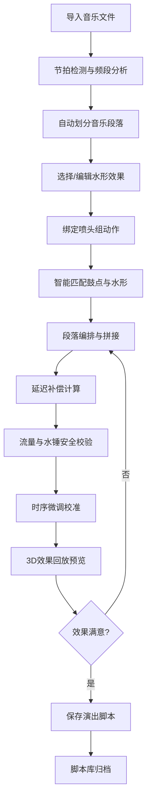

## 1. 产品概述

音乐喷泉阀门时序水形编排与节拍同步生产力系统，是一款面向音乐喷泉控制场景的专业桌面客户端软件，解决音乐与水形同步编排、时序校准、效果预览与脚本管理的全流程问题。

- **核心目标**：实现音乐节拍与喷泉水形的精准同步编排，提供可视化的时序编辑、智能水形匹配、安全预警与演出回放能力
- **目标用户**：音乐喷泉设计师、工程技术人员、演出策划人员
- **市场价值**：大幅提升水形编排效率，降低现场调试成本，保障演出安全与效果一致性

## 2. 核心功能

### 2.1 用户角色

| 角色 | 注册方式 | 核心权限 |
|------|----------|----------|
| 设计师 | 本地账号 | 音轨导入、水形编排、时序校准、脚本保存 |
| 工程师 | 本地账号 | 系统配置、参数校准、安全预警处理、硬件对接 |
| 管理员 | 本地账号 | 脚本库管理、用户权限、演出记录审计 |

### 2.2 功能模块

1. **音轨解析页**：音乐导入、节拍检测、频段能量分析、重音标记
2. **水形编排页**：喷头组管理、水形效果库、动作绑定、段落编排、自动匹配
3. **时序校准页**：延迟补偿计算、流量校验、水锤预警、时序微调
4. **脚本回放页**：演出模拟、时序可视化、跑动光影效果预览、实时监控
5. **脚本库页**：曲目分类、脚本管理、版本控制、演出记录

### 2.3 页面详情

| 页面名称 | 模块名称 | 功能描述 |
|----------|----------|----------|
| 音轨解析页 | 音轨导入 | 支持MP3/WAV/FLAC格式导入，显示波形与时长 |
| 音轨解析页 | 节拍检测 | 自动检测BPM、节拍点、重音位置，可视化标记 |
| 音轨解析页 | 频段分析 | 分低/中/高三频段实时能量分析，生成能量曲线 |
| 音轨解析页 | 段落划分 | 自动识别 intro/verse/chorus/bridge/outro 段落 |
| 水形编排页 | 喷头组管理 | 按区域/类型管理喷头组，配置阀门开关与变频参数 |
| 水形编排页 | 水形效果库 | 预设齐射/波浪/跑动/扇形/水柱等水形效果模板 |
| 水形编排页 | 动作绑定 | 拖拽绑定水形效果到喷头组，设置时间轴触发点 |
| 水形编排页 | 自动匹配 | 根据鼓点与旋律走向自动推荐水形效果组合 |
| 水形编排页 | 段落编排 | 按音乐段落分别编排，支持复制/拼接/过渡效果 |
| 时序校准页 | 延迟补偿 | 计算阀门开闭到水柱到达目标高度的物理延迟，自动提前触发 |
| 时序校准页 | 流量校验 | 实时计算泵组总流量，预警超过供水能力的风险点 |
| 时序校准页 | 水锤预警 | 检测多组阀门同时开闭的水锤冲击风险，给出调整建议 |
| 时序校准页 | 时序微调 | 毫秒级精确调整每个动作的触发时间 |
| 脚本回放页 | 演出模拟 | 3D可视化模拟喷泉效果，支持倍速/逐帧播放 |
| 脚本回放页 | 时序可视化 | 时间轴显示所有喷头动作时序，支持缩放定位 |
| 脚本回放页 | 光影预览 | 模拟相邻喷头时序错位形成的跑动光影效果 |
| 脚本回放页 | 数据监控 | 实时显示流量、压力、阀门状态等运行数据 |
| 脚本库页 | 曲目分类 | 按曲目风格、演出场景、难度等级分类管理 |
| 脚本库页 | 脚本管理 | 脚本的增删改查、版本对比、导入导出 |
| 脚本库页 | 演出记录 | 记录每场演出的时间、人员、设备状态、异常事件 |
| 脚本库页 | 快速搜索 | 按曲目名称、标签、创建时间快速检索 |

## 3. 核心流程

用户从导入音乐开始，经过节拍解析、水形编排、时序校准，最终生成可执行的演出脚本，支持回放预览和存档管理。

## 4. 用户界面设计

### 4.1 设计风格

**技术控制美学 (Techno-Industrial Control Aesthetic)**
- **主色调**：深空蓝 (#0A1628) 作为背景，营造专业控制室氛围
- **强调色**：霓虹青 (#00F0FF) 用于数据高亮和激活状态，熔岩橙 (#FF6B35) 用于预警，安全绿 (#00D26A) 用于正常状态
- **辅助色**：金属灰 (#1A2942)、电路银 (#8A9CB3)
- **按钮风格**：圆角矩形，微光边框，hover时发光效果，按下时有微缩反馈
- **字体**：展示字体使用 'Orbitron' 科技感字体，正文字体使用 'JetBrains Mono' 等宽字体确保数据对齐
- **布局风格**：分区模块化布局，类似工业控制室仪表盘，左侧导航+中央工作区+右侧参数面板
- **视觉元素**：波形图、频谱图、时间轴、网格背景、扫描线效果、数字仪表盘
- **图标风格**：线性轮廓图标，搭配发光效果，科技感强

### 4.2 页面设计概述

| 页面名称 | 模块名称 | UI元素 |
|----------|----------|--------|
| 音轨解析页 | 顶部工具栏 | 导入按钮、分析状态指示、BPM显示 |
| 音轨解析页 | 中央波形区 | 音频波形图、节拍点标记、频段能量曲线叠层显示 |
| 音轨解析页 | 底部时间轴 | 段落划分条、播放控制、缩放滑块 |
| 音轨解析页 | 右侧参数面板 | 检测参数配置、分析结果数据 |
| 水形编排页 | 左侧喷头树 | 喷头组层级列表、状态指示灯 |
| 水形编排页 | 中央编排区 | 时间轴轨道、水形效果块、拖拽操作 |
| 水形编排页 | 右侧效果库 | 水形效果卡片、预览动画、参数配置 |
| 水形编排页 | 底部段落栏 | 段落缩略图、过渡效果设置 |
| 时序校准页 | 中央校准网格 | 阀门动作时序矩阵、延迟补偿线 |
| 时序校准页 | 左侧参数区 | 物理参数配置（管径、扬程、响应时间） |
| 时序校准页 | 右侧预警区 | 流量超限预警、水锤风险列表 |
| 时序校准页 | 底部校验条 | 总流量曲线、压力模拟曲线 |
| 脚本回放页 | 中央3D视图 | 喷泉3D模拟场景、光影效果、相机控制 |
| 脚本回放页 | 顶部控制栏 | 播放控制、速度调节、视图切换 |
| 脚本回放页 | 左侧监控面板 | 实时数据仪表盘、阀门状态矩阵 |
| 脚本回放页 | 底部时序条 | 全局时间轴、播放头位置 |
| 脚本库页 | 左侧分类树 | 曲目分类文件夹、标签过滤 |
| 脚本库页 | 中央列表区 | 脚本卡片网格、封面缩略图、元数据 |
| 脚本库页 | 右侧详情面板 | 脚本详情、版本历史、演出记录 |

### 4.3 响应性

- **桌面优先设计**：针对1920x1080及以上分辨率优化，最小支持1280x800
- **自适应布局**：使用flex和grid实现各区域比例自适应，关键数据区永不被挤压
- **触控优化**：所有交互元素最小44x44px，支持高DPI显示
- **面板可折叠**：侧边面板可折叠以扩大中央工作区
- **窗口状态记忆**：记住用户的面板布局、窗口大小和位置

### 4.4 3D场景指引

- **环境**：夜间场景，深色背景配合霓虹灯光，营造沉浸式喷泉表演氛围
- **灯光**：多色聚光灯模拟水下彩灯，光柱穿透水雾效果，水面反射
- **相机**：默认透视视角，支持环绕、缩放、平移，预设多个观看角度
- **粒子系统**：水雾粒子、水滴飞溅效果，增强真实感
- **后处理**：Bloom泛光效果、轻微色差、景深，提升视觉冲击力
- **性能**：喷头数量控制在200以内，使用GPU实例化渲染，目标帧率60fps
